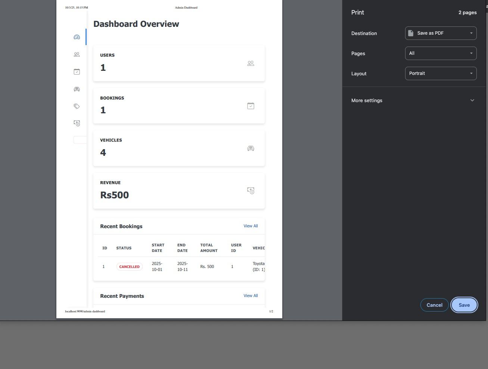

# VOYANTA Vehicle Rental System

A web-based Java application that allows users to rent vehicles online and provides administrative functionalities for managing vehicles and rental records.

## User Roles & Permissions

### Customer Features

- Register and login
- Browse available vehicles
- Book vehicles for specific dates
- View booking history
- Simulate payments

### Admin Features

- Admin login
- Add, update, delete vehicle records
- View and manage all rental bookings
- Manage registered users
- Update vehicle status

## Technology Stack

| Layer      | Technology                     |
|------------|---------------------------------|
| Frontend   | HTML, CSS, JavaScript, JSP      |
| Backend    | Jakarta EE (Servlets, JSP)      |
| Database   | MySQL                           |
| Architecture | MVC (Model-View-Controller)  |
| Server     | Apache Tomcat                   |
| Tools      | Intelij IDE, JDBC or JPA        |

## Screenshots

### Login Page

### Register Page

### Admin Dashboard

### Create New User

### View Users

### View Bookings

### View Vehicles

### Add New Vehicle

### Edit Vehicle

### View Categories

### Add New Category

### Edit Category

### View Payments

### Report Generation for Payments

### Report Generation for the Admin Dashboard

### Landing Page

### View Vehicles available for rent

### Search Vehicles available for rent

### Book Vehicles for Rent

### Booking summary

### View User bookings

### Update User Profile
